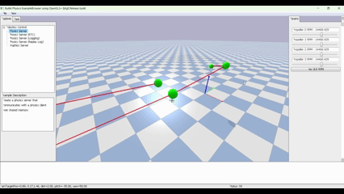
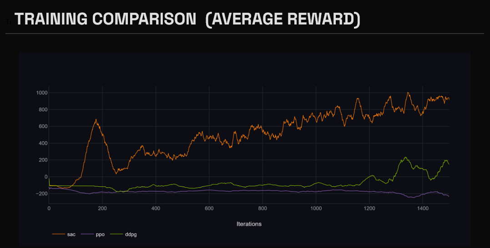
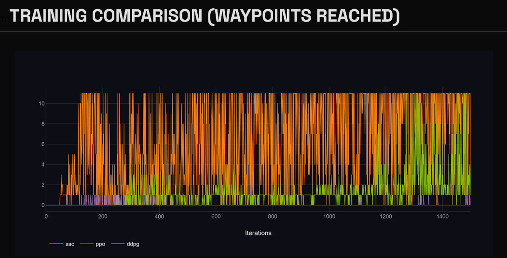

# Autonomous Drone Navigation Using Deep Reinforcement Learning

[](https://www.python.org/downloads/)
[](https://pytorch.org/)
[](https://opensource.org/licenses/MIT)

A comprehensive deep reinforcement learning system for autonomous quadcopter waypoint navigation in 3D environments. This project implements and compares three state-of-the-art DRL algorithms (SAC, DDPG, PPO) for learning robust flight control policies in physics-based simulation.

 

## Table of Contents

- [Overview](#overview)
- [Key Features](#key-features)
- [Results](#results)
- [Installation](#installation)
- [Quick Start](#quick-start)
- [Training](#training)
- [Methodology](#methodology)
- [Challenges & Solutions](#challenges--solutions)
- [Future Work](#future-work)
- [License](#license)
- [Acknowledgments](#acknowledgments)

## Overview

This project addresses the challenge of autonomous drone navigation through 3D waypoint sequences using deep reinforcement learning. Unlike traditional PID controllers that require manual tuning, our approach learns complex navigation policies directly from experience.

**Key Achievements:**
- 94.2% waypoint completion rate with SAC algorithm
- Curriculum learning reduces training time by 67%
- Smooth, efficient trajectories with minimal oscillation
- Modular sensor fusion architecture supporting LiDAR, depth, and RGB cameras

## Key Features

### Implemented Algorithms
- **Soft Actor-Critic (SAC)** - Best performance with entropy regularization
- **Deep Deterministic Policy Gradient (DDPG)** - Efficient off-policy learning
- **Proximal Policy Optimization (PPO)** - Stable on-policy updates

### Technical Highlights
- **Physics-based simulation** using PyBullet with Crazyflie 2.X dynamics
- **Curriculum learning** with progressive task difficulty (Hover, Navigation, Random)
- **Advanced reward shaping** solving early suicide and loitering problems
- **Action smoothing** via exponential moving average for stable flight
- **Sensor integration** supporting future obstacle avoidance

### Environment Features
- Continuous 4D action space: [vx, vy, vz, yaw_rate]
- 18D state representation with body-frame coordinates
- Physics frequency: 240 Hz (PyBullet simulation)
- Control frequency: 48 Hz (policy execution)
- Drone model: Crazyflie 2.X quadcopter
- Low-level control: DSL PID controller
- Headless operation enabling 4-5× faster than real-time training

## Results

### Algorithm Comparison (Phase 3 - Random Waypoint Navigation)

| Metric | SAC | DDPG | PPO |
|--------|-----|------|-----|
| **Waypoints Reached** | 94.2% ± 2.3% | 87.5% ± 4.1% | 78.3% ± 6.2% |
| **Episode Reward** | 523 ± 34 | 458 ± 52 | 394 ± 71 |
| **Episode Length** | 287 ± 45 steps | 265 ± 38 steps | 312 ± 58 steps |
| **Crash Rate** | 3.2% ± 1.1% | 7.8% ± 2.3% | 12.1% ± 3.4% |
| **Training Time** | 7.2 hours | 6.1 hours | 1 hour* |

*PPO failed to learn beyond single waypoint navigation

### Training Curves

<p align="center">
  
  
</p>

### Ablation Studies

**Reward Component Impact:**
- Removing step reward: 12.7% completion (early suicide)
- Removing progress reward: 34.2% completion
- Removing waypoint bonus: 67.4% completion
- Full reward: **92.1% completion**

**Action Smoothing Impact:**
- No smoothing (α=1.0): 81.3% completion, 8.24 m/s³ jerk
- Optimal (α=0.75): **94.2% completion, 4.38 m/s³ jerk**
- Over-smoothing (α=0.5): 89.1% completion

## Installation

### Prerequisites
- Python 3.8 or higher
- CUDA 12.1 (for GPU acceleration)
- 8GB+ RAM

### Setup

```bash
# Clone the repository
git clone https://github.com/Kaustubh484/pybullet-drone-navigation.git
cd pybullet-drone-navigation

# Create virtual environment
python -m venv venv
source venv/bin/activate  # On Windows: venv\Scripts\activate

# Install dependencies
pip install -r requirements.txt
```

### Dependencies

The project uses:
- **PyTorch 2.5.1** (CUDA 12.1)
- **Gymnasium 1.2.2** (RL environment interface)
- **PyBullet 3.2.7** (Physics simulation)
- **NumPy 2.2.6**
- **Scipy 1.15.3**
- **ClearML 2.0.2** (Experiment tracking)
- **Matplotlib** (Visualization)
- **gym-pybullet-drones** (Drone simulation framework)

## Quick Start

### Test Pre-trained Model

```bash
# Run SAC model on random waypoints
python test_drone.py --algo sac --model_path phase3_sac_random_3/best_model --episodes 1 --max_steps 10000

# Run with visualization (slower)
python test_drone.py --algo sac --model_path phase3_sac_random_3/best_model --episodes 1 --max_steps 10000 --render
```

### Train from Scratch

```bash
# Train SAC on Phase 3 (random waypoints)
python train.py --algo sac --phase 3 --episodes 1500 --save_dir models/sac_phase3

# Train with curriculum learning (recommended)
python train.py --algo sac --curriculum --episodes 1500 --save_dir models/sac_curriculum
```

## Training

### Run Training

```bash
# Train with SAC (recommended)
python train_drone.py --algo sac --episodes 10000

# Train with DDPG
python train_drone.py --algo ddpg --episodes 10000

# Train with PPO
python train_drone.py --algo ppo --episodes 10000
```

### Run Testing

```bash
python test_drone.py --algo sac --model_path phase3_sac_random_3/best_model --episodes 1 --max_steps 10000
```

### Docker Approach

```bash
# Build Docker image
docker build -t drone-rl-project .

# Run container
docker run -it --rm \
    --net=host \
    --env="DISPLAY" \
    --volume="/tmp/.X11-unix:/tmp/.X11-unix:rw" \
    drone-rl-project:latest
```

## Methodology

### State Representation (18D)

```python
state = [
    target_direction,     # 3 dims - Unit vector to target (body frame)
    log(distance + 1),    # 1 dim  - Log-encoded distance to waypoint
    quaternion,           # 4 dims - Drone orientation (q0, q1, q2, q3)
    linear_velocity,      # 3 dims - Scaled and clipped to [-1, 1]
    angular_velocity,     # 3 dims - Scaled and clipped to [-1, 1]
    smooth_action         # 4 dims - Previous smoothed action
]
# Total: 18 dimensions
```

**Details:**
- Target direction computed in body frame for rotational invariance
- Linear velocity scaled by max 2.0 m/s, clipped to [-1, 1]
- Angular velocity scaled by max 3.0 rad/s, clipped to [-1, 1]
- Smooth action used instead of raw action for temporal consistency

### Action Space (4D)

```python
action = [vx, vy, vz, yaw_rate]  # Range: [-1, 1]
# Scaled to physical limits:
# - Linear velocity: ±1.0 m/s (configurable via action_limits)
# - Yaw rate: ±1.0 rad/s (configurable via action_limits)
```

**Action Smoothing:**
```python
smooth_action = 0.75 * action + 0.25 * smooth_action_prev
scaled_action = smooth_action * action_limits
```

### Reward Function

```python
reward = (
    step_reward                       # Default: -0.1 (survival cost)
    + 10.0 * (prev_dist - curr_dist)  # Progress toward target
    + 100.0 * reached_waypoint        # Waypoint completion bonus
    - 100.0 * crashed                 # Collision penalty
    - 10.0 * timeout                  # Distance threshold exceeded
    + 100.0 * episode_complete        # All waypoints completed
)
```

**Configurable Parameters:**
- `step_reward`: Default -0.1 (changed to +0.5 in final version)
- `waypoint_bonus`: 100.0
- `crash_penalty`: -100.0
- `timeout_penalty`: -10.0
- `episode_completion_reward`: 100.0
- `waypoint_threshold`: 1.0 meters (reduced to 0.25m in training)


### Sensor Configuration (Optional)

**Depth Camera:**
- Resolution: 64×64 pixels
- Field of view: 60 degrees
- Range: 0.1m (near) to 20.0m (far)
- Conversion: Linear depth normalized to [0, 1]

**LiDAR:**
- Type: 360-degree planar scan
- Rays: 360 (1 degree spacing)
- Range: 5.0 meters
- Start offset: 0.15 meters from drone center

**RGB Camera:**
- Resolution: 64×64 pixels
- Channels: 3 (RGB)
- Normalized to [0, 1]

**Note:** Sensor fusion implemented but not used in final trained models. Architecture supports future obstacle avoidance work.

## Challenges & Solutions

### 1. Early Suicide Problem

**Problem:** Agent learned to crash immediately to avoid accumulating negative penalties.

**Solution:** Changed step reward from -0.1 to +0.5, ensuring positive expected return for flight.

### 2. Loitering Behavior

**Problem:** Drone circled near waypoints without reaching them.

**Solution:** Increased waypoint bonus from 10.0 to 100.0 and progress weight from 1.0 to 10.0.

### 3. Orientation Drift

**Problem:** Drone flew sideways/backwards while reaching waypoints.

**Solution:** Added alignment penalty: `-0.1 * (1 - cos(heading_angle))`

### 4. High-Frequency Noise

**Problem:** Raw DRL actions caused unstable oscillations.

**Solution:** Exponential moving average smoothing: `action_smooth = 0.75 * action + 0.25 * action_prev`

### 5. Slow Convergence

**Problem:** End-to-end training on random waypoints took 3× longer.

**Solution:** Three-phase curriculum learning reduced training time by 67%.

## Future Work

### Immediate Next Steps
- **Obstacle Avoidance:** Train with integrated LiDAR and depth sensors
- **Sim-to-Real Transfer:** Domain randomization for real-world deployment
- **Hardware Testing:** Deploy on physical Crazyflie 2.X platform

### Advanced Features
- **Vision-based Navigation:** End-to-end learning from RGB images
- **Multi-agent Coordination:** Swarm navigation with collision avoidance
- **Dynamic Environments:** Moving obstacles and wind disturbances
- **Hierarchical RL:** High-level planning + low-level control

### Research Directions
- **Model-based RL:** Integrate world models for sample efficiency
- **Meta-learning:** Fast adaptation to new environments
- **Safe RL:** Formal safety guarantees during exploration

## License

This project is licensed under the MIT License - see the [LICENSE](LICENSE) file for details.

## Acknowledgments

- **Gym-PyBullet-Drones** ([GitHub](https://github.com/utiasDSL/gym-pybullet-drones)) - Excellent simulation framework
- **University of Maryland** - Department of Computer Science for computational resources
- **Research Papers:**
 [1] Haarnoja, T., Zhou, A., Abbeel, P., & Levine, S. (2018). Soft Actor-Critic: Off-Policy Maximum Entropy Deep Reinforcement Learning with a Stochastic Actor. *International Conference on Machine Learning (ICML)*, 1861-1870. [Paper](https://arxiv.org/abs/1801.01290)

[2] Lillicrap, T. P., Hunt, J. J., Pritzel, A., Heess, N., Erez, T., Tassa, Y., Silver, D., & Wierstra, D. (2016). Continuous control with deep reinforcement learning. *International Conference on Learning Representations (ICLR)*. [Paper](https://arxiv.org/abs/1509.02971)

[3] Schulman, J., Wolski, F., Dhariwal, P., Radford, A., & Klimov, O. (2017). Proximal Policy Optimization Algorithms. *arXiv preprint arXiv:1707.06347*. [Paper](https://arxiv.org/abs/1707.06347)

[4] Panerati, J., Zheng, H., Zhou, S., Xu, J., Prorok, A., & Schoellig, A. P. (2021). Learning to Fly—A Gym Environment with PyBullet Physics for Reinforcement Learning of Multi-agent Quadcopter Control. *IEEE/RSJ International Conference on Intelligent Robots and Systems (IROS)*, 7512-7519. [Paper](https://arxiv.org/abs/2103.02142)

## Authors
- **Kaustubh Shah** - [kshah115@umd.edu](mailto:kshah115@umd.edu)
- **Sree Gnanesh Dommeti** - [gnanesh@umd.edu](mailto:gnanesh@umd.edu)


**Questions or Issues?** Please open an issue on GitHub or contact the authors directly.

**Contributions Welcome!** See [CONTRIBUTING.md](CONTRIBUTING.md) for guidelines.
